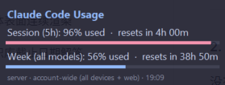

# Claude Usage Widget

A small always-on-top desktop widget for Windows that shows your **account-wide
Claude usage** — the 5-hour session window and the 7-day window — by reusing your
existing Claude Code login. No dependencies beyond the Python standard library.

Because it reads your account quota (not just this machine), the numbers include
usage from claude.ai on the web, mobile, and any other machine signed into the
same account.



## How it works

The widget tries three data sources, in order, and uses the first that succeeds:

1. **`GET /api/oauth/usage`** — the same free, read-only endpoint Claude Code's
   `/status` command uses. Costs nothing and returns exact utilization
   percentages for each window.
2. **Rate-limit header probe** — if the endpoint above is unavailable, it sends a
   single 1-token Haiku message and reads the `anthropic-ratelimit-unified-*`
   response headers. This spends a negligible amount of quota, so it is throttled
   to at most once every `probe_min_interval_seconds`.
3. **Local log estimate** — if both server paths fail, it estimates usage from
   Claude Code's own JSONL logs under `~/.claude/projects`. This reflects **only
   this machine** and is shown as weighted token counts (or percentages, if you
   set limits — see below).

When a server reading is available it shows **percentages**; the local fallback
shows **token counts** unless you have configured limits. Transient server
failures (a rate limit, a brief network drop) don't immediately change the
display: the last good server reading is kept and shown, marked stale, for up to
`max_stale_seconds`.

## Requirements

- **Windows** (built and tested on Windows 11; uses Win32 DPI awareness and an
  always-on-top frameless window).
- **Python 3.7+** — standard library only, no `pip install` needed.
- **Claude Code** signed in on this machine. The widget reads the OAuth token from
  `~/.claude/.credentials.json`; it never asks for or stores a separate key.

## Usage

Run without a console window:

```
pythonw claude_usage_widget.py
```

Run with a console to see status logging (data-source changes, rate-limit
backoff, etc.):

```
python claude_usage_widget.py
```

Interactions:

- **Drag** anywhere on the widget to move it. Its position is remembered.
- **Right-click** for a menu: refresh now, set the session limit, set the weekly
  limit, or exit.

To target a specific account, set `CLAUDE_CONFIG_DIR` to that account's Claude
config directory before launching.

## Configuration

Settings live in `usage_widget_config.json` next to the script. The file is
created automatically on first run and is **git-ignored** (it holds your window
position and personal limits). Any key you omit falls back to the default below.

| Key | Default | Meaning |
| --- | --- | --- |
| `session_limit_tokens` | `0` | Your 5-hour token budget. `0` hides the session percentage bar in the local-estimate view. |
| `weekly_limit_tokens` | `0` | Your 7-day token budget. `0` hides the weekly percentage bar in the local-estimate view. |
| `refresh_seconds` | `120` | How often to refresh the display. |
| `server_mode` | `true` | Use the account-wide server sources. Set `false` to use only local log estimates. |
| `probe_min_interval_seconds` | `600` | Minimum spacing between header probes (source 2). |
| `oauth_cooldown_seconds` | `300` | After the oauth endpoint returns HTTP 429, stop calling it for this long instead of retrying every refresh. |
| `max_stale_seconds` | `900` | How long a cached server reading may be reused (marked stale) when a live fetch fails, before falling back to local token counts. |
| `cache_read_weight` | `0.1` | Weight applied to cache-read tokens in local estimates (cache reads are far cheaper than fresh input). |
| `opacity` | `0.92` | Window opacity, 0.0–1.0. |
| `x`, `y` | `60`, `60` | Saved window position. |

**Calibrating the local view:** Anthropic does not publish exact plan quotas, so
the local estimate can't compute a percentage on its own. To get percentages in
the local fallback too, check `/usage` in Claude Code and set
`session_limit_tokens` / `weekly_limit_tokens` so the widget's token count lines
up with the percentage Claude Code reports. You can set these from the widget's
right-click menu.

## Notes and caveats

- This uses an **unofficial** mechanism (the same endpoints Claude Code uses).
  Anthropic could change it at any time, in which case the widget degrades to
  local estimates.
- Local estimates reflect **this machine only** and are approximate. Treat
  `/usage` in Claude Code as the authoritative view.
- The widget reads your credentials file but never transmits or stores your token
  anywhere other than the requests it makes to `api.anthropic.com`.
